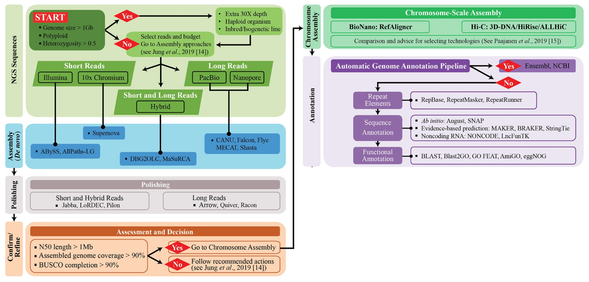
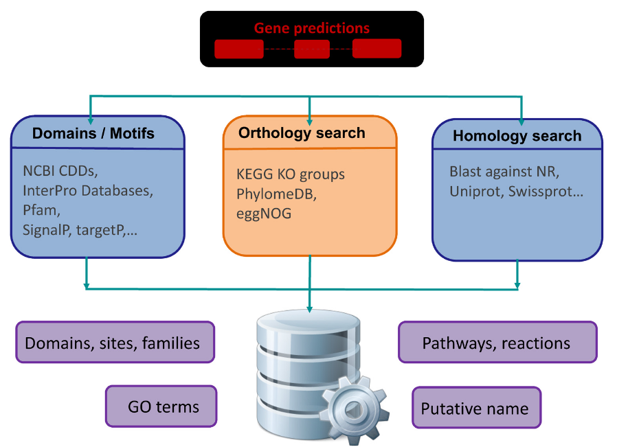
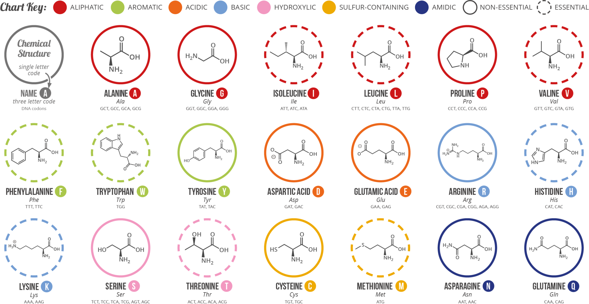
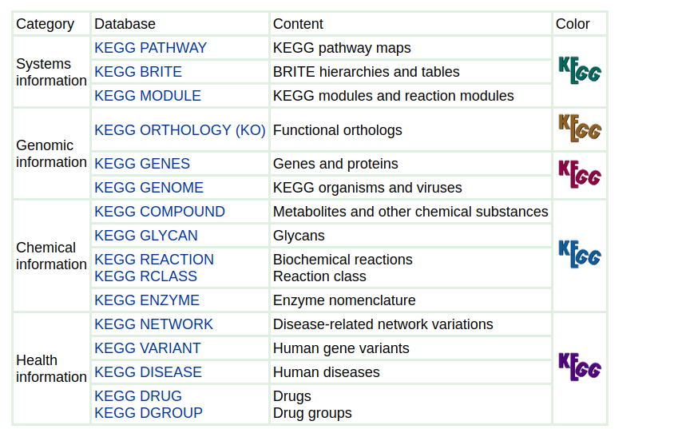
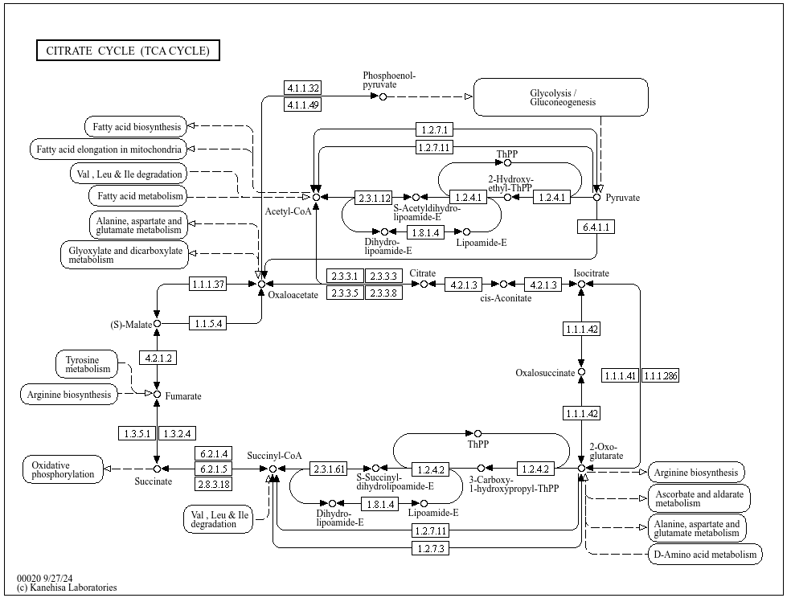
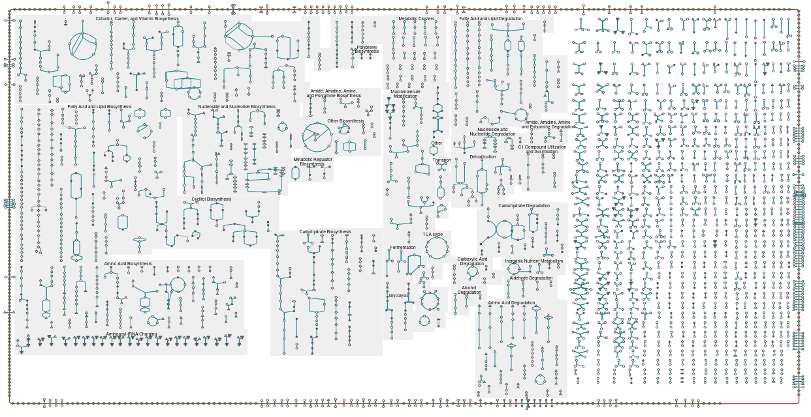
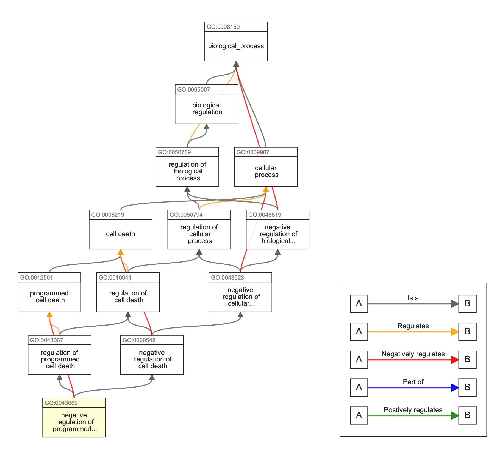
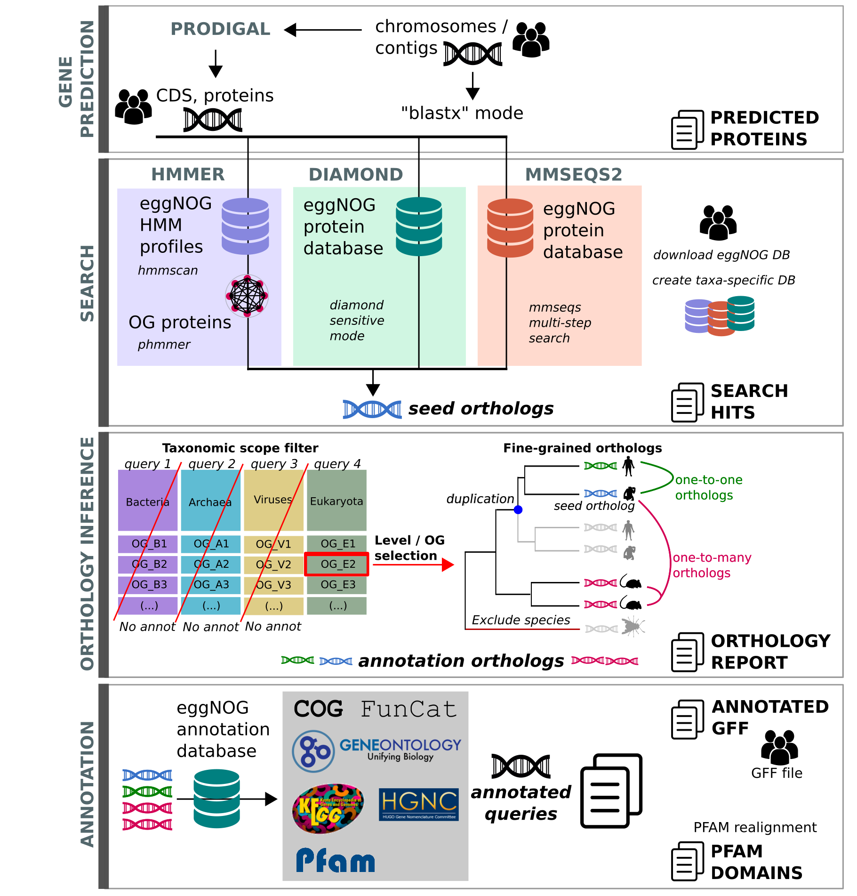
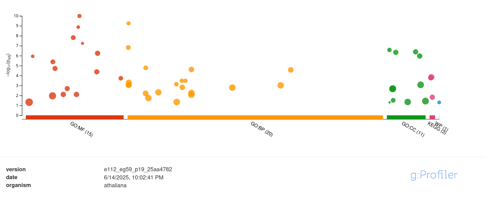

# Functional annotation databases
This repository contains the materials for the "Databases in ecology and comparative genomics course": day 3. It deals with functional annotation and relevant resources to attribute function and summarize the metabolism inferred from genomic and transcriptomic experiments 

Github URL:[https://github.com/claudioametrano/functional_annotation_db](https://github.com/claudioametrano/functional_annotation_db)

### Software required (on remote server)

- ncbi datasets
- Prokka
- Eggnog

### Software required (locally)
- a fasta file reader (MEGA, Aliview, Jalview, Bioedit ...)
- Terminal (Linux and Mac) or Mobaxterm (Win) to ssh into the remote server and a client (e.g. Filezilla) for easy file transfer

### BEFORE WE START

Login to your account on the HPC remote server and start an interactive session (`srun`)

```shell
$ ssh username@l2.gsc1.uni-graz.at

$ srun --mem=4G --ntasks=4 --cpus-per-task=1 --time=10:00:00 --pty bash
```

Download this repository:
```bash
$ git clone https://github.com/claudioametrano/functional_annotation_db.git
```

Rename the folder containing the results, so you won't overwrite it running the analyses of this tutorial, and create a new results folder
```bash
$ cd functional_annotation_db/
$ mv results results_backup  
$ mkdir results
```
## Introduction
### Genomic workflow: a recap

from [Jung et al. 2020](https://journals.plos.org/ploscompbiol/article?id=10.1371/journal.pcbi.1008325)modif.

In brief:
- Sample -> DNA extraction
- Library preparation
- Sequencing/base-calling
- Raw reads QC and filtering
- De novo assembly (or mapping on reference)
- Polishing and scaffolding
- Structural annotation -> non-coding and coding region: gene prediction (*ab initio* + evidence-based)
- **functional annotation**
- Visualization and submission
### What do we mean by genome annotation?
The term **"genome annotation"** is typically used to refer to two discrete bioinformatics tasks. The first of these is structural annotation, namely the prediction of the genomic intervals comprised of functional genome features: genes, transcripts associated with those genes, the exons comprising those transcripts, and for protein-coding transcripts their coding sequences (CDS) and untranslated regions (UTRs). The second  is functional annotation, namely assigning gene symbols (names) and putative functions to the structurally identified gene models, in order to associate biological information to genes and corresponding proteins.
We will focus here on functional annotation, displaying relevant database and software resources to assign amino-acid sequences to a putative function.


from [Del Angel et al., 2018](https://pmc.ncbi.nlm.nih.gov/articles/PMC5850084/)

Some of the method are not that different from the one you applied in day 1 and 2 (e.g. BLAST),
what makes the difference here is the completeness (in term of phylogenetic breadth) and accuracy of the annotations stored in databases, also in term of delimited orthogroups.

### Database and tools for functional annotation
Many tool and database with annotated genes/genes families are available to perform functional annotation. Also many of these databases have their own integrated tool to perform annotation (e.g. EggNOG and EggNOG mapper) and web-servers for quick search, but: 
- They do not necessarily "speak the same language": different gene identifiers, organization and hierarchy of the database and targeted feature (e.g. full coding sequence, domains)
- They do not cover necessarily the same set of genes
- Lack of annotation for a relevant fraction of genes outside core metabolism (in non-model organisms)

**Despite the plethora of different accession number standards adopted by different databases, there is a good interchange among databases, which also report the accession and the classification of other relevant databases for the same protein.**

### Relevant resources

| Database (tool)                         | Number entries                                                     | URL                                        | Notes                                                                                                                         |
| --------------------------------------- | ------------------------------------------------------------------ | ------------------------------------------ | ----------------------------------------------------------------------------------------------------------------------------- |
| **UniProtKB**                           | 573 230 **Swiss-Prot** (reviewed); 252 188 522 **TrEMBL** proteins | [uniprot](https://www.uniprot.org)         | Sequence records split into manually-curated and automatically annotated sets; cross-links to nearly every other DB           |
| **InterPro** (InterProScan)             | ≈ 48 k protein signatures                                          | [interpro](https://www.ebi.ac.uk/interpro) | hmm profiles; GO terms present                                                                                                |
| **Pfam**                                | 24 424 protein families                                            | now hosted by Interpro                     | HMM families grouped into structural “clans”                                                                                  |
| **Cluster Of Orthologs**                | 5,050 COGs from 2,103 bacterial and 193 archaeal species           | [COG](www.ncbi.nlm.nih.gov/research/COG)   | mostly for Bacteria and Archea                                                                                                |
| **Gene Ontology (e.g. AmiGO; BLAST2GO)**     | 185 k controlled terms (BP/MF/CC)                                  | [GO](https://geneontology.org)             | Standard vocabulary for functional enrichment; Structured ontology                                                            |
| **KEGG** (e.g. BlastKOALA)                   | 27 663 K numbers; 580 pathway maps                                 | [kegg](https://www.genome.jp/kegg)         | Gold-standard metabolic & signaling network ;Genes grouped into KO orthologs; KO nodes populate manually drawn pathway graphs |
| **BioCyc and MetaCyc**  | 3 153 pathways; 19 020 reactions; 19 372 metabolites               | [metacyc](https://metacyc.org)             | Metabolic pathways; metabolic modelling                                                                                       |
| **eggNOG** (eggNOG mapper)              | 17 032 907 orthologous groups across 12 535 genomes                | [eggnog](http://eggnog5.embl.de)           | Hierarchical orthology clusters with functional tags                                                                          |
| **OrthoDB** v12                         | 162 M genes from 5 827 euks + 18 158 proks + 7 962 viruses         | [www.orthodb](https://www.orthodb.org)     | Ortholog groups at multiple phylogenetic depths; Supplies lineage datasets for **BUSCO**                                      |
| **Protein Data Bank** (PBD)                 | ~240000 structures; ~1M computed structures                        | [pdb](https://www.rcsb.org/pdb/)           | Since 1971 the reference for protein structure, and one of the oldest biological DB                                           |
| **AlphaFold**  (AlphaFold Server/API)   | > 214 M predicted 3-D structures                                   | [alphafold](https://alphafold.ebi.ac.uk)   | Structure-based; function clues for “hypothetical” proteins                                                                   |
| Carbohydrate-Active enZYmes Database (CAZY)    |                                     | [Cazy](https://www.cazy.org/)   | Specialized database for enzymes that catalyze reaction involving, oligo- and polysaccharides                                      |
| **Reactome**                            | 2 742 pathways (15 492 reactions)                                  | [reactome](https://reactome.org)           | Curated pathways; human                                                                                                       |



from [here](https://www.compoundchem.com/2014/09/16/aminoacids/)

### 1. Wandering through databases 
Let's try some of the annotation resources with this not yet annotated protein that could be one of the output of our structural annotation workflow

> protein1
MKAISRVLIAMVAAIAALFTSTGTSHAGLDNELSLVDGQDRTLTVQQWDTFLNGVFPLDRNRLTREWFHSGRAKYIVAGPGADEFEGTLELGYQIGFPWSLGVGINFSYTTPNILIDDGDITAPPFGLNSVITPNLFPGVSISADLGNGPGIQEVATFSVDVSGAEGGVAVSNAHGTVTGAAGGVLLRPFARLIASTGDSVTTYGEPWNMN

Try to copy/paste the sequecne into: 

**UniProt** -> Peptide search
- BLAST for similar sequence within the DB
- Functional profile by GO

**Interpro**
- Protein family (Pfam), domains and their components( e.g. secondary structure  beta-sandwich)

**EggNOG** -> Sequence search
- Identify Orthologs in other taxa 
- deliver a taxonomic profile of taxa having that orthologous sequences
- Functional profile that integrates GO, KEGG, and Domains (Pfam, SMART)

  ***NOTE***
> WHAT IS A PROTEIN DOMAN: It is a distinct part of a protein’s overall chain that often carries out a specific function. Think of a domain as a modular “sub-unit”. It can fold > into a stable 3-D structure on its own. They’re frequently swapped or duplicated
> during evolution, giving rise to multi-domain proteins with new combinations of capabilities.

### TASK 1 
>compare the 3-D structure showed in UniProt for the previously submitted protein, with the one generated by [Alphafold server](https://alphafoldserver.com/)
>**Questions**
> - Do the reference structure (X-ray) match with the one you obtain running Alphafold?
> - How many monomers has the Uniprot 3D structure?
> - Can you try to re-run alphafold with a sequence that could approach the final quaternary structure of the oligomerized protein?
>

*** NOTE *** 
> **X-ray protein crystallography**: existed long before computational models were available, and it is still a fundamental aid for accurate protein structure. It is a technique by which it is possible to determine the three dimensional positions of each atom in a protein. Now over 100 years old, x-ray  crystallography was first used to determine the three dimensional structures of inorganic materials, then small organic molecules, and finally macromolecules like DNA and proteins. [full text here](https://phys.libretexts.org/Courses/University_of_California_Davis/Biophysics_200A%3A_Current_Techniques_in_Biophysics/X-ray_Protein_Crystallography)

### 2. How to summarize the overwhelming amount of information of functional annotation: pathway analysis and Gene Ontology (GO) 

#### 2.1 Pathway analysis 
To understand how genes and molecules (gene products and metabolites) are networked to describe a known biological phenotype.
- Reduces complexity of information (from thousands of genes to hundreds of pathways).
- Pathway enrichment analysis, which generates a list of over-represented pathways in a gene list.

##### ** KEGG pathways: Kyoto Encycplopedia of Genes and Genomes**
Collection of manually curated pathways maps, includes relation among:
Genes, proteins (enzymes, ...), Compounds (substrates), pathways (what pathways are connected to this particular gene?)
Includes information about:
Metabolism, Genetic information processing, Cellular processes (e.g. transport), Organismal systems (e.g. Immune system), Diseases, Drug development




##### MetaCyc and BioCyc 
A collecion of computationally predicted (and curated) metabolic pathways and operons of a single organism (or multiple: MetaCyc)
- Cellular overview summarizing the complete metabolic map
- Metabolism comparison between organisms
- Overlay with other omics data (e.g. transcriptomics, pathway enrichment)
- Organisms classified according to the  level of curation (3 tiers)
- Integrated genome browser

Cellular metabolism of *S. cerevisiae*


#### 2.2 Gene Ontology
Genes can be analyzed at different levels: 
- Single gene (sequence, function) 
- Group of genes, possibly framed into pathways (KEGG, MetaCyc)
- Hierarchically grouping genes using their features

What problems GO try to solve?
Vast amount of biological data, different name/term for the same concepts (e.g. translation = protein synthesis) and difficult comparison among species -> need for **standardized descriptive terms -> Gene Ontology**.

GO: describes the functions of gene products, using a dictionary of allowed words, using standardized vocabulary terms (and codes) that are usable both by humans and computers.
These terms are in relation each other in a directed acyclic graph and they are divided into **three species-independent categories (ontologies)**:
- **Biological processes**
- **Cellular components**
- **Molecular function**





### 3.  Annotation: a case study using cyanobacteria
Why Cyanobacteria:
- Compact genomes
- Simpler gene structure
- High metabolic diversity

| Strain (NCBI RefSeq)                             | Lifestyle & trait highlights        | Genome size |
| ------------------------------------------------ | ----------------------------------- | ----------- |
| Synechocystis sp. PCC 6803* (GCF_000009725.1)    | Facultative heterotroph, freshwater | 3.6 Mb      |
| *Prochlorococcus marinus MED4* (GCF_000011465.1) | Ultra-oligotrophic, marine          | 1.66 Mb     |
| *Nostoc sp. PCC 7120* (GCF_000009705.1)          | Filamentous; freshwater             | 7.2 Mb      |

#### 3.1 Assembly download (Already available in `data/`)
```bash
$ singularity pull https://depot.galaxyproject.org/singularity/ncbi-datasets-cli:14.26.0
$ singularity exec ncbi-datasets-cli:14.26.0 datasets download genome accession GCF_000009725.1 GCF_000011465.1 GCF_000009705.1 --include genome
```
or

```bash
$ wget https://ftp.ncbi.nlm.nih.gov/genomes/all/GCF/000/009/725/GCF_000009725.1_ASM972v1/GCF_000009725.1_ASM972v1_genomic.fna.gz
$ wget https://ftp.ncbi.nlm.nih.gov/genomes/all/GCF/000/011/465/GCF_000011465.1_ASM1146v1/GCF_000011465.1_ASM1146v1_genomic.fna.gz
$ wget https://ftp.ncbi.nlm.nih.gov/genomes/all/GCF/000/009/705/GCF_000009705.1_ASM970v1/GCF_000009705.1_ASM970v1_genomic.fna.gz
```


#### 3.2 Prokka:  rapid prokaryotic genome annotation
Prokariotic genome assembly are the easiest, fastest to annotate, given their simpler gene structure and compact genomes. [Prokka Github](https://github.com/tseemann/prokka#prokka-rapid-prokaryotic-genome-annotation)

The following image is rather big (~800 Mb; Prokka runs many software, such as Prodigal, therefore the image also contains many dependencies), if you have it already available elsewhere, copy it here to the main folder of the repository and skip the next command
```bash
$ singularity pull https://depot.galaxyproject.org/singularity/prokka:1.14.6--pl5321hdfd78af_5
```

```bash
$ singularity exec prokka\:1.14.6--pl5321hdfd78af_5 prokka --outdir results/Synechocystis_GCF_000009725.1 --prefix Synechocystis --cpu 1 ./data/GCF_000009725.1_ASM972v1_genomic.fna 
```

run the same for the other two samples (adjust names!) ...**or loop**, as manual repeated steps are prone to mistakes! NO big deal with three samples though.

**Runtime example: Synechocystis Prokka runtime: 12.32 minutes on 16 cores of Intel(R) Xeon(R) Gold 6132 CPU @ 2.60GHz**

##### 3.2.1 Prokka output
To make sense of the results two things are always useful when you run complex pipelines
- Check [manual](https://github.com/tseemann/prokka/tree/master) to see if output is described, spoiler: it is!
- Follow the main steps (tools adopted) of the pipeline to understand what it does to produce such outputs, see the following task... 

### TASK2 
>Looking at Prokka stdout (printed to screen, or at one of the samples's logfile) try to identify the what software the pipeline uses for different steps (structural annotation steps (CDS, tNRA, rRNA), functional annotation etc.). If there is some software you do not know, search for its manual or Github page to roughly understand its function within Prokka.
>

#### 3.2.2. Functional annotation in Prokka
Open one of the report
```bash
$ less results/Synechocystis_GCF_000009725.1/Synechocystis.tsv 
```
**Locus_tag**: name of the feature in Prokka

**ftype**: type of feature

**lenghth_bp**

**gene**: gene name as convetional abbreviation. If multiple annotated they are followed by _1 _2 etc.

**EC_number**: (Enzyme Commission), classification according to Nomenclature Committee of the International Union of Biochemistry and Molecular Biology (IUBMB). [here](https://iubmb.qmul.ac.uk/) or [here](https://enzyme.expasy.org/)

For example:
**EC 1.1.1.1** → _Alcohol dehydrogenase_

- Class 1 → Oxidoreductases (enzymes catalyzing oxidation-reduction reactions)
    
- Subclass 1 → Acting on the CH-OH group of donors
    
- Sub-subclass 1 → With NAD⁺ or NADP⁺ as acceptor
    
- Serial number 1 → First enzyme in this category

**COG**: Cluster of Ortholog classification

**product**: description of the protein

Many sequences identified ad CDS are not annotated, but this is normal. Annotation can be improved if providing Prokka with more extensive references.

### TASK 3

> Not only proteins are annotated: in Prokka output identify annotated tRNA.
> How many in the 3 genome tested? 
> What is their theoretical maxium number/How many did you expect?

#### 3.3 Functional annotation with EggNOG mapper
Prokka provide some basic, mostly bacterial-oriented, functional annotation, let's try to complete the annotation with the support of EggNOG mapper and its database.
**EggNOG-mapper** is a tool for fast functional annotation of novel sequences, being based on orthology predictions it should permits a higher precision than traditional homology searches (i.e. BLAST searches), avoiding transferring annotations from paralogs.

How it works:
input (genome, CDS or protein) -> (Optional) gene prediction (Prodigal) -> Search (diamond or mmseqs or hmmer) -> attribution to orthologous group  -> Functional annotation (emapper) with various database (KEGG, GO, pfam)


Also this container is quite large, maybe use the copy in the shared folder (if any)
```bash 
$ singularity pull https://depot.galaxyproject.org/singularity/eggnog-mapper:2.1.12--pyhdfd78af_0
```

Set up folder and input file (Prodigal/Prokka .faa fasta: ouptut of the structural annotation)
```bash
$ mkdir results/eggnog_annotation
$ cp ./results/Nostoc_GCF_000009705.1/Nostoc.faa ./results/eggnog_annotation/
$ cp ./results/Synechocystis_GCF_000009725.1/Synechocystis.faa ./results/eggnog_annotation/
$ cp ./results/Prochlorococcus_GCF_000011465.1/Prochlorococcus.faa ./results/eggnog_annotation/
```
...or use the convenient command `find`
```bash
find -type f -name *.faa -exec cp {} results/eggnog_annotation/ \;
```


>[!CAUTION]
One of the database file is large and takes long to download and unzip. If pre-downloaded elsewhere, do not download it.
List of file and folders you will need (Diamond): eggnog.taxa.db, eggnog.taxa.db.traverse.pkl,  eggnog.db, eggnog_proteins.dmnd)

Download the appropriate database  
Orthologs from specific lineages are available [here](http://eggnog5.embl.de/#/app/downloads) , using taxid code (e.g. Cyanobacteria = 1117).
```bash
$ singularity exec --bind $(pwd):/usr/local/lib/python3.11/site-packages/data eggnog-mapper\:2.1.12--pyhdfd78af_0   download_eggnog_data.py -y
```
the folder /usr/local/... is linked to our working directory because the script need to put the database there (it will show up in our current directory). `-y` skips the interactive question answering yes to all, so we can run `singularity exec` effectively

Lauch the mapper
>[!CAUTION]
>This command is memory intensive and can run for long 
```bash
singularity exec --bind $(pwd):/usr/local/lib/python3.11/site-packages/data eggnog-mapper\:2.1.12--pyhdfd78af_0 emapper.py --cpu 1 -i results/eggnog_annotation/Nostoc.faa --itype proteins   --go_evidence all -o nostoc --output_dir results/eggnog_annotation/ --excel -d bact --tax_scope 1117 --override
```
eggnog.db is the previously downloaded database (in this case the Cyanobacteria orthologs)

EggNOG output:  emapper.annotations, emapper.hits, emapper.seed_orthologs
(optionally annotation also in .xlsx)
```bash
$ less -S results/eggnog_annotation/nostoc.emapper.annotations
```

#### 3.4 Visualize and summarize results
Hierarchic output such as those from GO term functional annotation can be represented to perform visual comparisons, for example using [Krona](https://github.com/marbl/Krona/wiki). Even if usually adopted for taxonomic data (also hierarchically organized), Krona plot can be adapted to show, for example GO frequencies 

#### Krona plot visualization 
Installed krona and its dependencies in a dedicated conda environment (It should already exist)
```bash
# create conda environment and install dependancies
$ conda create -n krona python=3.12.2
$ conda activate krona
$ conda install -c conda-forge python-wget=3.2
$ conda install -c bioconda krona=2.8.1 goatools=1.2.3
$ conda install -c conda-forge pandas=2.3.0 openpyxl=3.1.5
```
If "krona" conda environments is already there then...

```bash
$ conda activate krona
```

Get the GO term db
```bash
$ wget http://current.geneontology.org/ontology/go-basic.obo
``` 
Launch this script for each of the eggnog xlsx output files
```bash
$ python egg2krona_go.py ./results/eggnog_annotation/synechocystis.emapper.annotations.xlsx --obo go-basic.obo --out ./results/eggnog_annotation/krona_go_synecho.html
```

#### 3.5 Use GO and pathways

### TASK4
**A naive example of GO term analysis**
Parsing the annotation files:
**A.** Verify if some of these Cyanobacteria is capable Nitrogen fixation:
- Search in [QuickGO](https://www.ebi.ac.uk/QuickGO/term/GO:0009399) the **GO** term which identify "Nitrogen fixation"
- What proteome, among the three Cyanobacteria has the highest frequency of genes that code for proteins involved in this **Biological Process**? Which of them is then a nitrogen fixer?
- Observe how also the other two genomes has this GO term (with a much lower frequency)
**B.**
Verify if all these Cyanobacteria have Phycobilisomes (protein complexes containing accessory pigments)

### 4 Enrichment analysis application: Transcriptomics
In addition to their descriptive use in comparative genomics (between different species/taxa), a common real-world use of these cellular function summaries is to identify differences between experimental conditions (for the same organism). The enrichment analysis of GO  terms (or pathways) performed on differentially expressed genes (significantly Up or Down regulated) in transcriptomics studies, helps to summarize and reveal which parts of cellular metabolism responded to a specific condition (e.g. temperature changes, drug exposure, pollutant stress), in comparison to the control sample.

Example of enrichment analysis with  [g:Profiler](https://biit.cs.ut.ee/gprofiler/gost), provide a list of differentially expressed genes, and obtain which GO and pathway are significantly enriched.

